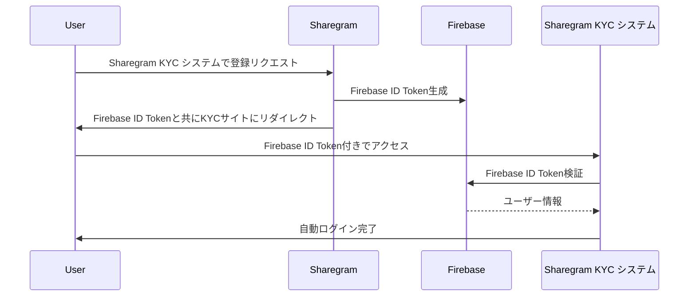

# Sharegram/Sharegram KYC システム 統合API仕様書

# Sharegram/Sharegram KYC システム 統合API仕様書

## 1. 概要

本ドキュメントは、Sharegram(コンテンツプラットフォーム)とSharegram KYC システム(KYC・出演者情報管理)間の連携API仕様を定義します。

### 1.1 システム構成

```
[Sharegram] ←→ [Sharegram KYC システム]
    (A)              (B)
```

### 1.2 システム概要

- **Sharegram(A)**: コンテンツ配信・課金プラットフォーム
- **Sharegram KYC システム(B)**: KYC・出演者情報管理システム

### 1.3 連携の目的

- Sharegramユーザーの出演者情報をSharegram KYC システムで管理
- 身分証明書などの機密情報の安全な保管
- コンテンツ承認に基づく自動的な書類検証
- シームレスなユーザー体験の提供

## 2. 共通仕様

### 2.1 ベースURL

- **Sharegram KYC システム API**: `https://api.sharegram-kyc.com/v1`
- **Sharegram API**: `https://api.sharegram.com/v1`

### 2.2 認証方式(標準ソリューションを利用)

### 2.2.1 SSO認証（Firebase Authentication使用）

```
Authorization: Bearer {firebase_id_token}
Content-Type: application/json

```

### 2.2.2 システム間API認証

```

Authorization: Bearer {api_key}
X-API-Client: sharegram
Content-Type: application/json
```

### 2.3 共通レスポンス形式

```json
{
  "success": true|false,
  "data": {...},
  "error": {
    "code": "ERROR_CODE",
    "message": "エラーメッセージ"
  }
}

```

## 3. 認証・SSO連携API

※他の標準ワークフローでも可能

### 3.1 Firebase Authentication SSO連携



### 3.2 Firebase ID Token検証 [Sharegram KYC システム実装]

**エンドポイント**: `POST /auth/firebase-verify`

**リクエスト**:

```json
{
  "id_token": "eyJhbGciOiJSUzI1NiIsInR5cCI6IkpXVCJ9...",
  "client_id": "sharegram_platform"
}

```

**レスポンス**:

```json
{
  "success": true,
  "data": {
    "user": {
      "firebase_uid": "firebase_user_123",
      "name": "山田太郎",
      "email": "yamada@example.com",
      "external_id": "sharegram_user_789"
    },
    "session_token": "local_session_token_abc123"
  }
}

```

### 3.3 Firebase SSO認証開始 [Sharegram KYC システム実装]

**エンドポイント**: `GET /auth/firebase-sso`

**クエリパラメータ**:

- `id_token`: Firebase ID Token (必須)
- `redirect_url`: 認証後のリダイレクト先URL (オプション)

**レスポンス**: 成功時は指定URLへリダイレクト、失敗時はエラーページ

## 4. 出演者情報連携API

### 4.1 出演者情報同期 [Sharegram KYC システム実装]

**エンドポイント**: `POST /performers/sync`

**認証**: システム間API認証

**説明**: Sharegramからの出演者情報をSharegram KYC システムに同期

**リクエスト**:

```json
{
  "performer": {
    "external_id": "sharegram_performer_456",
    "lastName": "山田",
    "firstName": "花子",
    "lastNameRoman": "Yamada",
    "firstNameRoman": "Hanako",
    "user_id": "sharegram_user_123"
  }
}

```

**レスポンス**:

```json
{
  "success": true,
  "data": {
    "performer": {
      "id": "skyc_performer_123",
      "external_id": "sharegram_performer_456",
      "lastName": "山田",
      "firstName": "花子",
      "lastNameRoman": "Yamada",
      "firstNameRoman": "Hanako",
      "status": "pending",
      "created_at": "2025-05-29T10:15:30Z"
    }
  }
}

```

### 4.2 出演者情報取得 [Sharegram KYC システム実装]

**エンドポイント**: `GET /performers/:id`

**認証**: システム間API認証

**パスパラメータ**:

- `id`: 出演者ID (Sharegram KYC システム側のID)

**クエリパラメータ**:

- `external_id`: 外部ID検索の場合は`true`を指定

**レスポンス**:

```json
{
  "success": true,
  "data": {
    "performer": {
      "id": "skyc_performer_123",
      "external_id": "sharegram_performer_456",
      "lastName": "山田",
      "firstName": "花子",
      "lastNameRoman": "Yamada",
      "firstNameRoman": "Hanako",
      "status": "pending",
      "created_at": "2025-05-29T10:15:30Z",
      "updated_at": "2025-05-29T10:15:30Z"
    }
  }
}

```

### 4.3 出演者一覧取得 [Sharegram KYC システム実装]

**エンドポイント**: `GET /performers`

**認証**: システム間API認証

**クエリパラメータ**:

- `page`: ページ番号 (デフォルト: 1)
- `limit`: 1ページあたりの件数 (デフォルト: 20、最大: 100)
- `status`: ステータスでフィルタ (pending, active, rejected)
- `external_ids`: 外部IDでフィルタ (カンマ区切り)

**レスポンス**:

```json
{
  "success": true,
  "data": {
    "performers": [
      {
        "id": "skyc_performer_123",
        "external_id": "sharegram_performer_456",
        "lastName": "山田",
        "firstName": "花子",
        "status": "pending"
      }
    ],
    "pagination": {
      "total": 42,
      "page": 1,
      "limit": 20,
      "pages": 3
    }
  }
}

```

### 4.4 出演者情報登録完了通知 [Sharegram実装]

**エンドポイント**: `POST /performers/registration-complete`

**認証**: システム間API認証

**説明**: Sharegram KYC システム側での出演者情報登録完了をSharegramに通知

**リクエスト**:

```json
{
  "performer_id": "skyc_performer_123",
  "external_id": "sharegram_performer_456",
  "status": "pending",
  "documents": [
    {
      "type": "agreementFile",
      "verified": false
    },
    {
      "type": "idFront",
      "verified": false
    },
    {
      "type": "selfie",
      "verified": false
    }
  ]
}

```

**レスポンス**:

```json
{
  "success": true,
  "data": {
    "message": "出演者情報登録が完了しました",
    "redirect_url": "https://sharegram.com/performers/sharegram_performer_456"
  }
}

```

## 5. 身分証明書連携API

### 5.1 身分証明書情報取得 [Sharegram KYC システム実装]

**エンドポイント**: `GET /performers/:performer_id/documents`

**認証**: システム間API認証

**パスパラメータ**:

- `performer_id`: 出演者ID

**クエリパラメータ**:

- `external_id`: 外部ID検索の場合は`true`を指定

**レスポンス**:

```json
{
  "success": true,
  "data": {
    "documents": [
      {
        "id": "doc_123",
        "type": "agreementFile",
        "name": "出演同意書",
        "mime_type": "application/pdf",
        "verified": true,
        "verified_at": "2025-05-30T12:00:00Z",
        "verified_by": "admin_user_id"
      },
      {
        "id": "doc_124",
        "type": "idFront",
        "name": "身分証明書（表面）",
        "mime_type": "image/jpeg",
        "verified": false,
        "verified_at": null,
        "verified_by": null
      }
    ]
  }
}

```

### 5.2 身分証明書ダウンロード [Sharegram KYC システム実装]

**エンドポイント**: `GET /performers/:performer_id/documents/:document_type/download`

**認証**: システム間API認証

**パスパラメータ**:

- `performer_id`: 出演者ID
- `document_type`: 書類タイプ (agreementFile, idFront, idBack, selfie, selfieWithId)

**クエリパラメータ**:

- `external_id`: 外部ID検索の場合は`true`を指定

**レスポンス**: バイナリファイルデータ (Content-Typeはファイル形式に応じて設定)

### 5.3 身分証明書メタデータ取得 [Sharegram KYC システム実装]

**エンドポイント**: `GET /performers/:performer_id/documents/metadata`

**認証**: システム間API認証

**パスパラメータ**:

- `performer_id`: 出演者ID (external_idパラメータがtrueの場合はSharegram側のID)

**クエリパラメータ**:

- `external_id`: 外部ID検索の場合は`true`を指定

**レスポンス**:

```json
{
  "success": true,
  "data": {
    "documents": [
      {
        "type": "agreementFile",
        "name": "出演同意書",
        "status": "verified",
        "last_updated": "2025-05-30T12:00:00Z"
      },
      {
        "type": "idFront",
        "name": "身分証明書（表面）",
        "status": "pending",
        "last_updated": "2025-05-29T10:15:30Z"
      }
    ]
  }
}

```

## 6. 検証ステータス連携API

### 6.1 検証ステータス更新 [Sharegram KYC システム実装]

**エンドポイント**: `PUT /performers/:performer_id/documents/:document_type/verify`

**認証**: Firebase Authentication（管理者権限）

**パスパラメータ**:

- `performer_id`: 出演者ID
- `document_type`: 書類タイプ

**リクエスト**:

```json
{
  "verified": true,
  "verified_by": "admin_user_id",
  "notes": "承認済みコンテンツに紐づく出演者として検証"
}

```

**レスポンス**:

```json
{
  "success": true,
  "data": {
    "document": {
      "type": "idFront",
      "verified": true,
      "verified_at": "2025-05-30T15:45:00Z",
      "verified_by": "admin_user_id"
    },
    "all_verified": true
  }
}

```

### 6.2 コンテンツ承認通知Webhook [Sharegram KYC システム実装]

**エンドポイント**: `POST /webhooks/content-approved`

**認証**: システム間API認証

**説明**: Sharegram側でコンテンツが承認された際の通知を受け取り、関連する出演者の書類を検証済みにする

**リクエスト**:

```json
{
  "content_id": "content_789",
  "content_title": "サンプルコンテンツ",
  "performer_ids": ["sharegram_performer_456", "sharegram_performer_457"],
  "approved_at": "2025-05-30T15:30:00Z",
  "approved_by": "admin_user_id"
}

```

**レスポンス**:

```json
{
  "success": true,
  "data": {
    "updated_performers": [
      {
        "external_id": "sharegram_performer_456",
        "status": "active",
        "documents": [
          {"type": "agreementFile", "verified": true},
          {"type": "idFront", "verified": true},
          {"type": "selfie", "verified": true}
        ]
      }
    ]
  }
}

```

### 6.3 KYC承認処理 [Sharegram KYC システム実装]

**エンドポイント**: `POST /performers/:performer_id/approve`

**認証**: システム間API認証 + 管理者セッション認証

**パスパラメータ**:

- `performer_id`: 出演者ID

ヘッダー：

```jsx
Authorization: Bearer {system_api_key}
X-Admin-Session: {admin_session_token}
X-API-Client: sharegram-kyc-admin
Content-Type: application/json
```

**リクエスト**:

```json
{
  "admin_user_id": "admin_123",
  "admin_session_id": "session_abc",
  "approval_action": "approve",
  "approval_level": "final",
  "notes": "身分確認書類及び出演同意書確認済み",
  "notify_sharegram": true
}

```

**レスポンス**:

```json
{
  "success": true,
  "data": {
    "performer": {
      "id": "skyc_performer_123",
      "external_id": "sharegram_performer_456",
      "status": "approved",
      "approved_at": "2025-05-30T15:30:00Z",
      "approved_by": "admin_user_id"
    },
    "sharegram_notification": {
      "status": "sent",
      "message": "KYC承認完了通知を送信しました"
    }
  }
}

```

### 6.4 KYC承認通知 [Sharegram実装]

**エンドポイント**: `POST /performers/kyc-approved`

**認証**: システム間API認証

**説明**: Sharegram KYC システム側での出演者承認をSharegramに通知

**リクエスト**:

```json
{
  "performer_id": "skyc_performer_123",
  "external_id": "sharegram_performer_456",
  "status": "approved",
  "approval_action": "approve",
  "approval_level": "final",
  "approved_at": "2025-05-30T15:30:00Z",
  "approved_by": "admin_user_id",
  "admin_session_id": "session_abc",
  "notes": "身分確認書類及び出演同意書確認済み"
}

```

**レスポンス**:

```json
{
  "success": true,
  "data": {
    "message": "KYC承認通知を受信しました",
    "performer_status": "verified"
  }
}

```

## 7. 連携状態管理API

### 7.1 連携状態確認 [両システム実装]

**エンドポイント**: `GET /integration/status`

**認証**: システム間API認証

**レスポンス**:

```json
{
  "success": true,
  "data": {
    "status": "active",
    "last_sync": "2025-05-30T14:00:00Z",
    "api_version": "1.0",
    "features": {
      "firebase_sso": true,
      "document_sharing": true,
      "verification_sync": true
    }
  }
}

```

### 7.2 連携ヘルスチェック [両システム実装]

**エンドポイント**: `GET /integration/health`

**認証**: システム間API認証

**レスポンス**:

```json
{
  "success": true,
  "data": {
    "status": "healthy",
    "response_time": 42,
    "service_checks": {
      "database": "ok",
      "storage": "ok",
      "api": "ok",
      "firebase": "ok"
    }
  }
}

```

## 8. エラーコード一覧

| エラーコード | 説明 | HTTPステータス |
| --- | --- | --- |
| `AUTH_INVALID_TOKEN` | 認証トークンが無効 | 401 |
| `AUTH_EXPIRED_TOKEN` | 認証トークンの有効期限切れ | 401 |
| `AUTH_INSUFFICIENT_PRIVILEGES` | 権限不足 | 403 |
| `FIREBASE_AUTH_ERROR` | Firebase認証エラー | 401 |
| `RESOURCE_NOT_FOUND` | リソースが見つからない | 404 |
| `VALIDATION_ERROR` | リクエスト内容が不正 | 400 |
| `INTEGRATION_ERROR` | システム連携エラー | 500 |
| `DOCUMENT_UNAVAILABLE` | 書類が利用できない | 404 |
| `PERFORMER_NOT_FOUND` | 出演者が見つからない | 404 |
| `DUPLICATE_RECORD` | 重複レコード | 409 |
| `SERVER_ERROR` | サーバー内部エラー | 500 |

## 9. サンプルフロー

### 9.1 Firebase SSO認証フロー(修正)

**前提**: 両システムが同じ標準ソリューション(Firebaseなど)を使用

1. Sharegram(A)ユーザーが「Sharegram KYC システムで新規作成」をクリック
2. Sharegram(A)がユーザーをSharegram KYC システム(B)にリダイレクト（ユーザー識別情報付き）
3. Sharegram KYC システム(B)がFirebase認証状態を確認
4. 既にログイン済みの場合、そのまま適切なページに遷移
5. 未ログインの場合の選択肢(Sharegramにリダイレクトしてログインを促す)

### 9.2 書類連携フロー

1. ユーザーがSharegram KYC システム(B)で出演者情報と書類を登録
2. 登録完了時にSharegram KYC システム(B)が`/performers/registration-complete`でSharegram(A)に通知
3. Sharegram(A)のUI上に書類登録完了表示
4. Sharegram(A)は`/performers/:performer_id/documents/metadata`でメタデータ取得
5. ユーザーが書類を表示/ダウンロードする際、直接Sharegram KYC システム(B)のAPIを呼び出しデータを取得し、ユーザーに提供

### 9.3 検証連携フロー

1. Sharegram KYC システム(B)管理者が出演者をKYC承認(承認・検証ボタンクリック)
2. 管理者のアクションにより`/performers/:performer_id/approve`APIが実行される
3. Sharegram KYC システム(B)がSharegram(A)の`/performers/kyc-approved`にWebhook送信
4. Sharegram(A)が出演者のステータスを検証済み状態(表示は検討)に更新
5. ユーザーがSharegram(A)にアクセスした際、検証済み(もしくは、承認済み)ステータスが表示される