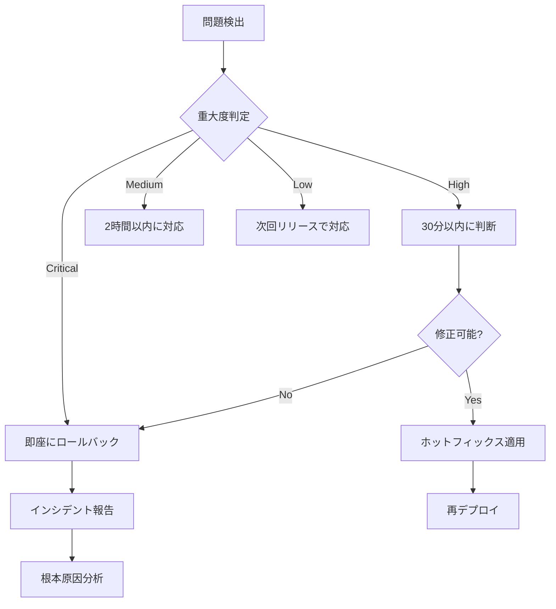

# Firebase統合 段階的デプロイプラン

## 概要
本ドキュメントは、Firebase統合を本番環境に安全にデプロイするための段階的なプランを定義します。

## デプロイフェーズ

### Phase 1: ステージング環境検証（Day 1-3）

#### 目的
- Firebase統合の全機能をステージング環境で検証
- パフォーマンステストの実施
- セキュリティスキャンの実行

#### 実施内容
```bash
# ステージング環境へのデプロイ
./deploy-firebase-integration.sh staging full

# 自動テストの実行
npm run test:e2e
npm run test:integration
npm run test:security

# パフォーマンステスト
npm run test:performance
```

#### 成功基準
- [ ] すべての自動テストがパス
- [ ] エラー率 < 0.1%
- [ ] 応答時間 < 500ms (95パーセンタイル)
- [ ] セキュリティ脆弱性なし

### Phase 2: カナリアデプロイ（Day 4-5）

#### 目的
- 本番環境の10%のトラフィックで新バージョンを検証
- 実際のユーザートラフィックでの動作確認

#### 実施内容
```bash
# カナリアデプロイの実施
./deploy-firebase-integration.sh production canary

# 監視期間: 24時間
# 監視項目:
# - エラー率
# - 応答時間
# - Firebase認証成功率
# - メモリ/CPU使用率
```

#### 成功基準
- [ ] エラー率の増加 < 0.5%
- [ ] 応答時間の増加 < 10%
- [ ] Firebase認証成功率 > 99%
- [ ] リソース使用率の異常なし

### Phase 3: 段階的展開（Day 6-8）

#### 目的
- トラフィックを段階的に新バージョンに移行
- 各段階で動作を確認

#### 実施スケジュール

| 日程 | トラフィック割合 | 監視期間 | ロールバック判断 |
|------|-----------------|----------|------------------|
| Day 6 AM | 25% | 4時間 | エラー率 > 1% |
| Day 6 PM | 50% | 4時間 | エラー率 > 1% |
| Day 7 AM | 75% | 8時間 | エラー率 > 0.5% |
| Day 8 AM | 100% | 継続監視 | エラー率 > 0.5% |

#### 実施コマンド
```bash
# 各段階でのトラフィック調整
./scripts/configure-canary-traffic.sh 25
./scripts/configure-canary-traffic.sh 50
./scripts/configure-canary-traffic.sh 75
./deploy-firebase-integration.sh production full
```

### Phase 4: 完全移行と最適化（Day 9-10）

#### 目的
- 旧バージョンの完全停止
- システムの最適化
- ドキュメントの更新

#### 実施内容
1. 旧バージョンコンテナの停止
2. 不要なリソースのクリーンアップ
3. キャッシュ設定の最適化
4. 監視アラートの調整
5. ドキュメントの最終更新

## リスク管理

### 想定されるリスクと対策

| リスク | 影響度 | 発生確率 | 対策 |
|--------|--------|----------|------|
| Firebase認証の不具合 | 高 | 低 | 即座にロールバック、ユーザーに通知 |
| パフォーマンス劣化 | 中 | 中 | キャッシュ戦略の見直し、スケールアウト |
| データ不整合 | 高 | 低 | トランザクション管理強化、バックアップから復元 |
| セキュリティ脆弱性 | 高 | 低 | 即座にパッチ適用、WAF設定強化 |

### 緊急時の対応フロー



## コミュニケーション計画

### ステークホルダー通知

| フェーズ | 通知対象 | タイミング | 内容 |
|----------|----------|------------|------|
| 開始前 | 全社員 | 3日前 | デプロイ計画の共有 |
| Phase 1 | 開発チーム | 開始時 | ステージング検証開始 |
| Phase 2 | 運用チーム | 開始1時間前 | カナリアデプロイ開始通知 |
| Phase 3 | カスタマーサポート | 各段階開始前 | 段階的展開の進捗 |
| 完了後 | 全社員 | 完了直後 | デプロイ完了報告 |

### 問題発生時の連絡体制

1. **第一報**: Slackの#deployment-alertsチャンネル
2. **エスカレーション**: 
   - 15分以内: チームリード
   - 30分以内: 部門長
   - 1時間以内: CTO
3. **外部通知**: 重大な影響がある場合はステータスページを更新

## 成功指標

### 技術的指標
- デプロイ時間: < 2時間
- ロールバック時間: < 15分
- サービス可用性: > 99.9%
- エラー率: < 0.1%

### ビジネス指標
- ユーザー満足度: 維持または向上
- サポートチケット数: 通常の範囲内
- 新規登録率: 影響なし
- コンバージョン率: 維持または向上

## チェックポイント

各フェーズ終了時に以下を確認：

- [ ] 予定された作業がすべて完了
- [ ] 成功基準を満たしている
- [ ] 次フェーズへの準備が整っている
- [ ] ドキュメントが更新されている
- [ ] チーム全体が状況を把握している

## 付録

### 関連ドキュメント
- [Firebase統合デプロイチェックリスト](./firebase-deployment-checklist.md)
- [ロールバック手順書](./firebase-rollback-procedures.md)
- [監視ガイド](./monitoring-guide.md)
- [トラブルシューティングガイド](../sharegram-troubleshooting-guide.md)

### ツールとリソース
- デプロイスクリプト: `/safevideo/deploy-firebase-integration.sh`
- 監視ダッシュボード: `http://monitoring.example.com/firebase-deploy`
- ログ集約: `http://logs.example.com/firebase-integration`
- アラート設定: `http://alerts.example.com/firebase`